#  Library Management System

A web-based Library Management System that allows students to borrow and return books, request donations, and enables admin to manage inventory and approvals.

---

##  Features

- Student & Admin Login  
- Book Borrow & Return System  
- Donation Request Handling  
- Admin Approval Workflow  
- Transaction History  
- Book Search & Category System  
- Dashboard for Management  

---

##  Technologies Used

- PHP  
- MySQL  
- HTML  
- CSS  
- JavaScript  

---

##  Project Structure

- admin/ → Admin panel  
- student/ → Student interface  
- config/ → Database configuration  
- assets/ → CSS, images  

---
##  Screenshots

###  Home Page
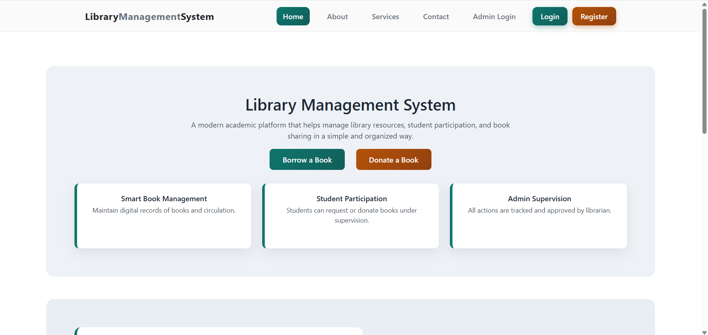
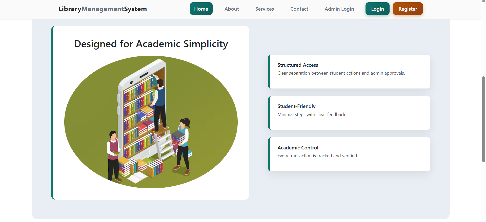

### About page
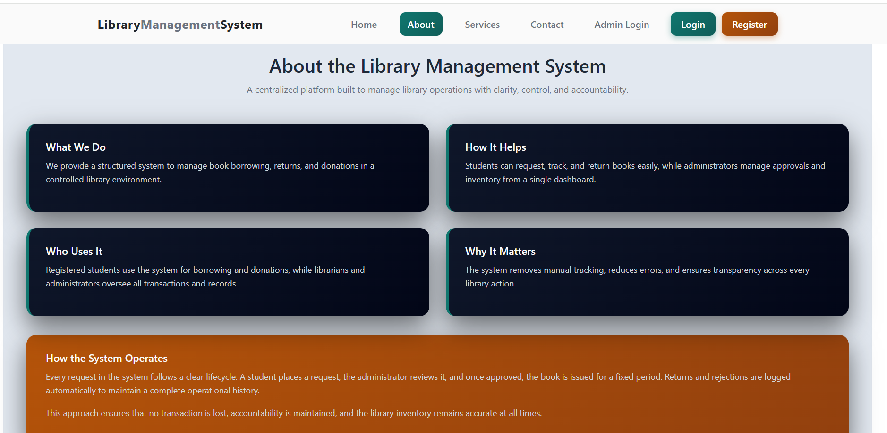

###  Login Page
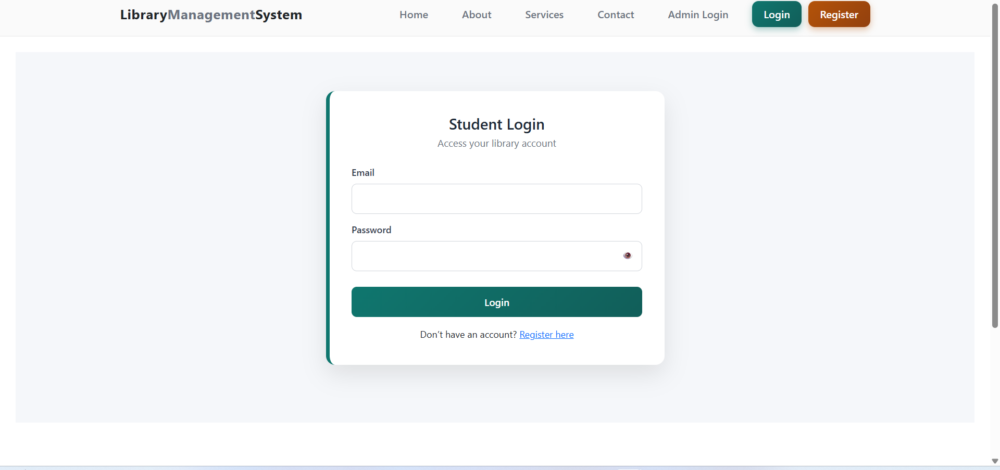

###  Register Page
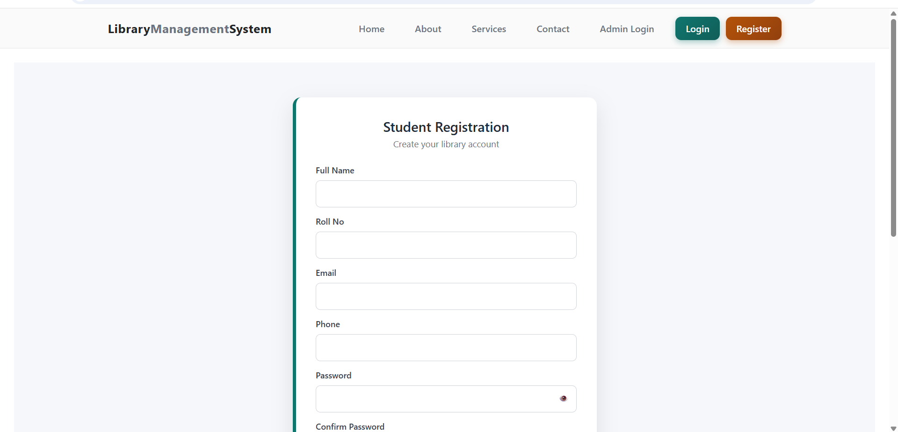

###  Dashboard
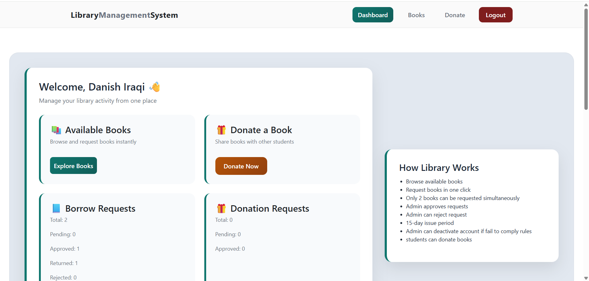

.png)

###  Admin Dashboard
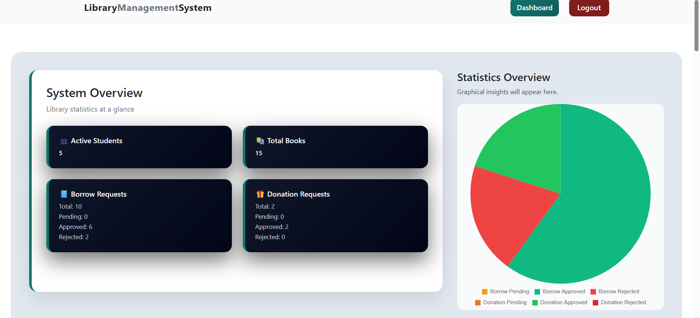

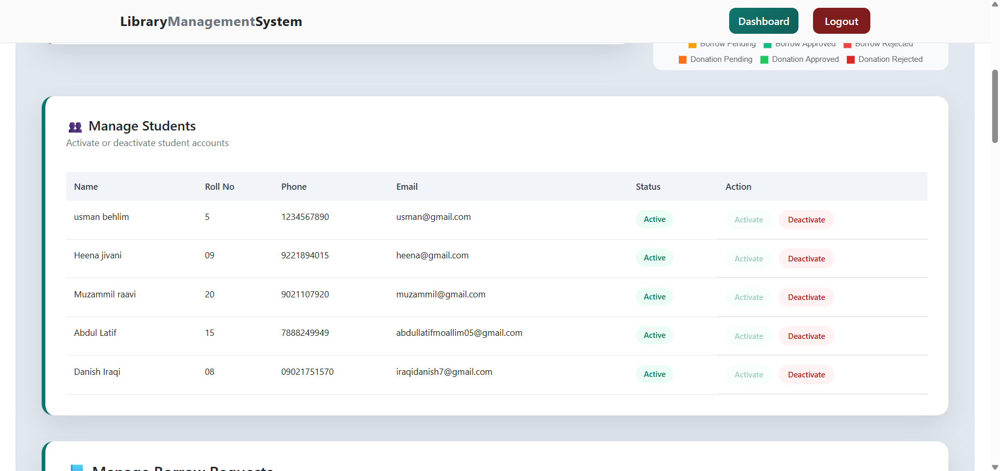

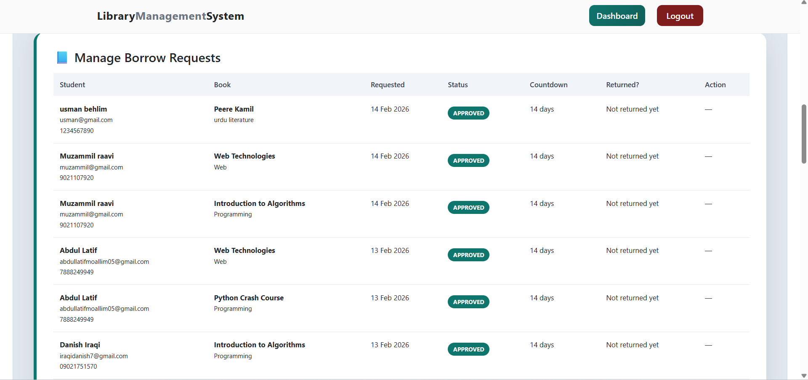

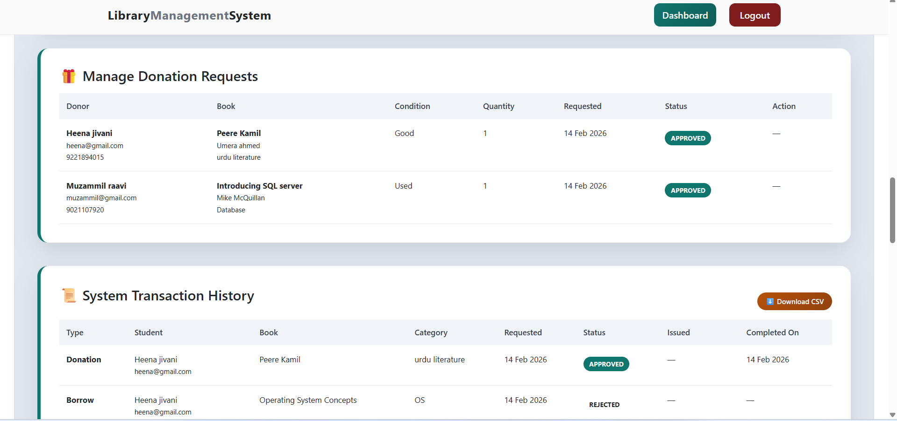

###  Available Books
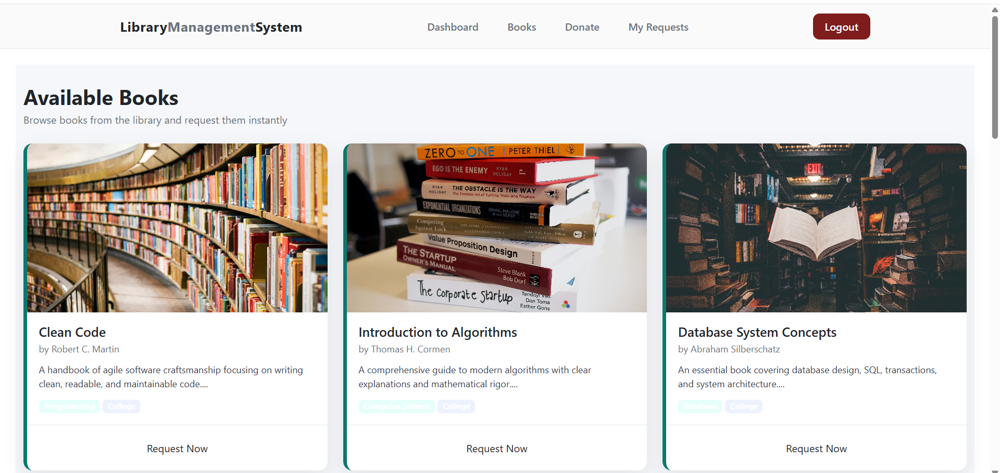
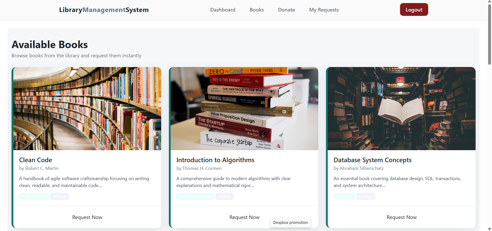

###  Donation
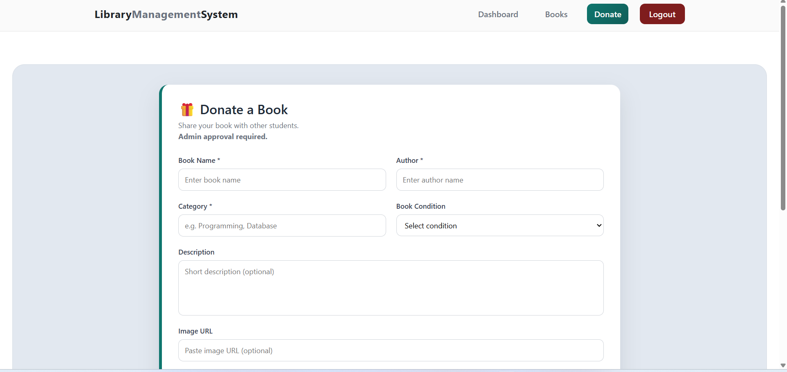

###  Contact Page
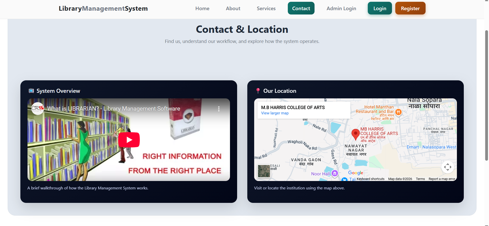

###  Services Page
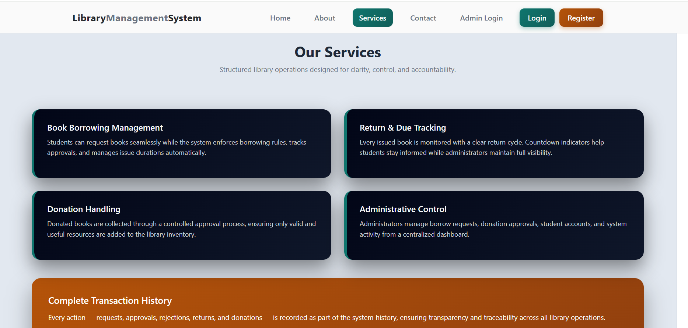

##  How to Run

1. Install XAMPP  
2. Start Apache & MySQL  
3. Import database  
4. Run project in browser  

---

##  Future Improvements

- Online book reservation  
- Notifications system  
- UI enhancements
